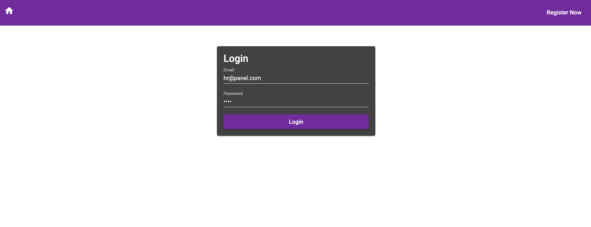
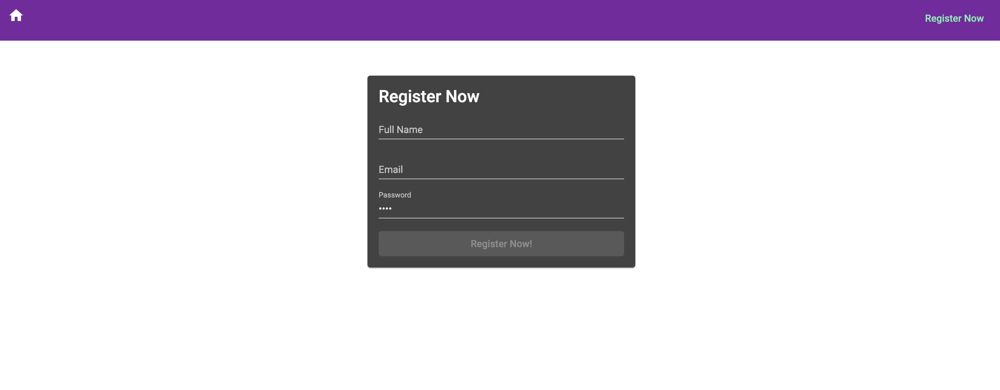
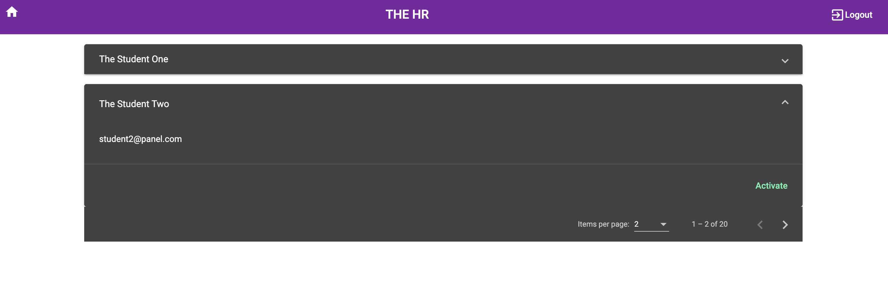
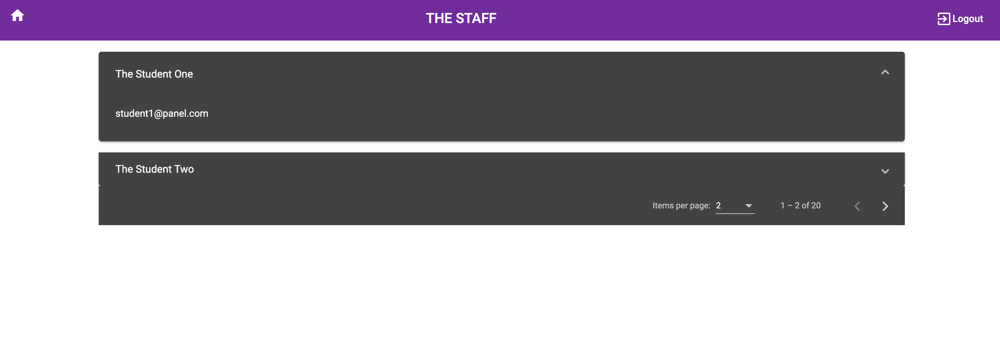
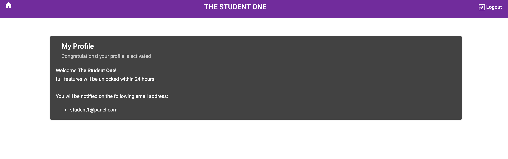

# Frontend

This project was generated with [Angular CLI](https://github.com/angular/angular-cli) version 8.3.9.

## Development server

Run `npm i` to install dependencies.

Run `ng serve` for a dev server. Navigate to `http://localhost:4200/`. The app will automatically reload if you change any of the source files.

## Users

- hr@panel.com (The hr role)
- staff@panel.com (The staff role)
- student1@panel.com (The student role)
- All above users are active and have `test` password

## Screenshots

### The Login Screen

### The Registration Screen

### The HR Screen

### The Staff Screen

### The Student Screen

